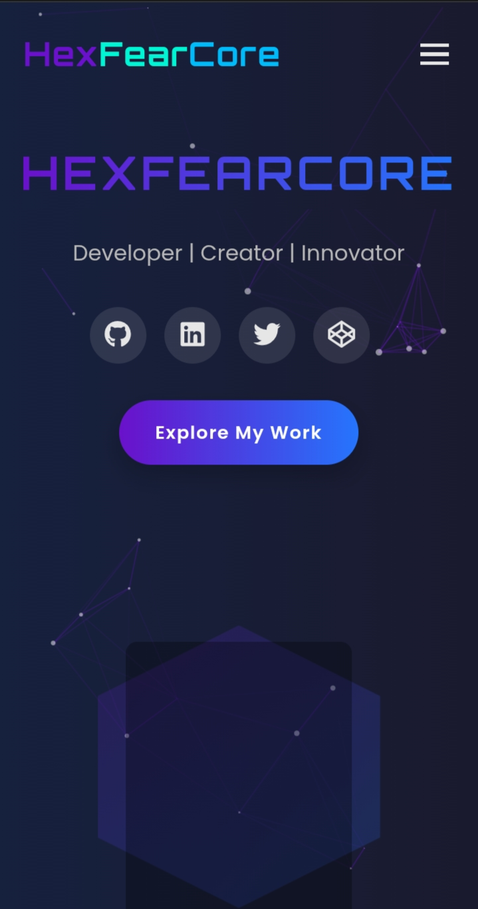

# HexFearCore Portfolio



A beautiful, interactive portfolio website for GitHub profile (hexfearcore) built with HTML, CSS, and JavaScript.

## Features

- Modern, responsive design
- Interactive particle.js background
- Animated elements and transitions
- Project showcase section
- Skills visualization
- Contact form
- Mobile-friendly navigation

## Technologies Used

- HTML5
- CSS3 (Flexbox, Grid, Animations)
- JavaScript (ES6+)
- Particles.js for interactive background
- Font Awesome icons
- Google Fonts

## Installation

1. Clone the repository:
   ```bash
   git clone https://github.com/hexfearcore/WEBPROJECTS.git
   cd WEBPROJECTS
   cd hexfearcore-portfolio
   
   
